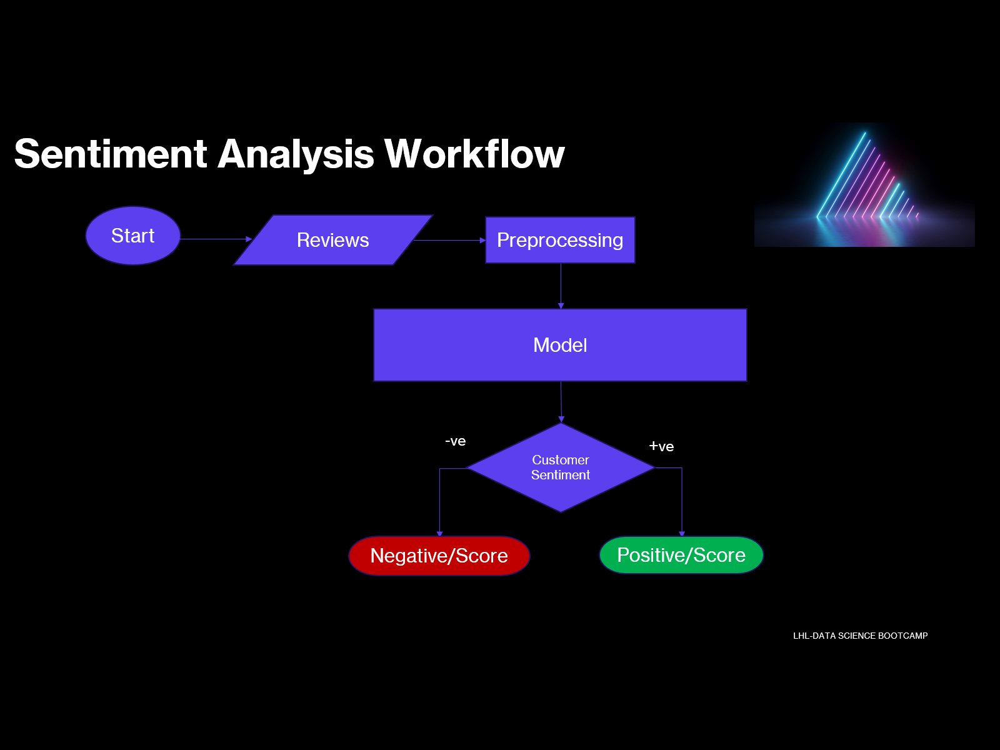

# Product Review Sentiment Analysis using Machine Learning

## Overview
This project focuses on sentiment analysis, specifically predicting the sentiment of customer reviews on Amazon food products using machine learning algorithms.

## Process
### Exploration
The dataset is thoroughly explored to gain a comprehensive understanding of its contents. Python and Excel are utilized for data exploration.

### Cleaning
The data cleaning process begins by addressing easy-to-detect issues, such as removing rows with NULL values.

### Workflow

### Models Utilized
Four pretrained models are used for sentiment prediction:
- Juliensimon/reviews-sentiment-analysis
- Transformer Pipeline-sentiment-analysis
- VADER
- TextBlob

## Insights
These models provide sentiment labels (Negative/Positive) and sentiment score ranges (-1 to 1), aiding in measuring positivity/negativity.

## Outcomes
This project aims to help businesses understand customer experiences better and make informed decisions based on sentiment analysis results.

## Future Goals
- Fine-tune pretrained models for enhanced performance.
- Train a model from scratch for specialized requirements.
- Explore sentiment analysis in diverse domains like tweets, comments, and financial sentiments.

## Challenges
- Handling unlabeled data.
- Grappling with complex human emotions.
- Addressing sarcasm.
- Requires significant resources and time for development and implementation.
